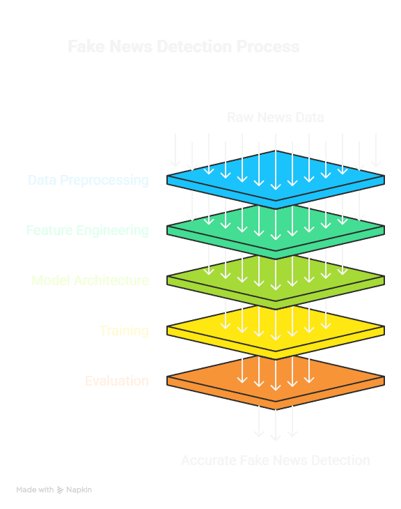
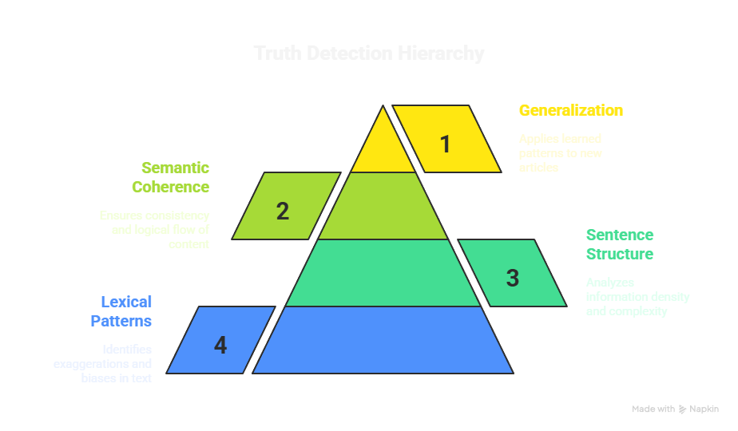
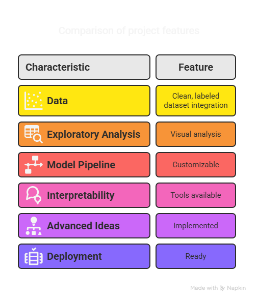

📰 Fake News Detection Using NLP and Deep Learning(TASK 2)

📌 Project Summary
In the era of rapid digital communication, fake news has emerged as a serious threat to public trust and social stability. This project presents a deep learning-based NLP solution for automatically detecting fake news articles using real-world datasets.

---
🚀 What This Project Does
This project classifies news articles as real or fake using natural language processing techniques and neural networks. It utilizes labeled datasets containing genuine and fabricated news and builds a robust, interpretable model to distinguish between the two with high accuracy.

---
⚙️ How It Works
Data Preprocessing:

Datasets (True.csv, Fake.csv) are cleaned, merged, and labeled.

Text data is constructed by combining the article's title and content.

Feature Engineering:

Word embeddings (e.g., TF-IDF, GloVe, or BERT-based embeddings).

Sentiment scores and contextual metadata (optional in advanced versions).

Model Architecture:

Baseline: LSTM/GRU or Dense Neural Networks.

Advanced: Transformer-based models like BERT or RoBERTa.

Ensemble techniques may be used to combine outputs from multiple architectures.

Training:

Supervised learning using binary cross-entropy loss.

Split into training and validation sets, optionally cross-validated.

Optional: Adversarial training, contrastive learning, or meta-learning.

Evaluation:

Confusion Matrix, ROC-AUC curve, classification report.

Attention heatmaps and SHAP/LIME visualizations for interpretability.

---
🧠 Core Logic
The model learns patterns in language, semantics, and tone that are statistically correlated with either truthful or fabricated content. It focuses on:

Lexical and contextual patterns (e.g., exaggerations, bias).

Sentence structure and information density.

Semantic coherence and topic consistency.

By training on these signals, the model generalizes to identify new, unseen news articles as likely real or fake.

---
✨ Project Features
✅ Clean, labeled dataset integration

📊 Visual Exploratory Analysis:

Word clouds for fake vs real articles

Confusion matrix and ROC curve

🤖 Customizable model pipeline: Swap in different model architectures

🔍 Interpretability tools (e.g., attention heatmaps, SHAP, LIME)

🧠 Advanced ideas implemented:

Ensemble methods

Adversarial sample resistance

Knowledge graph support (optional)

🌐 Ready for deployment or research extension

